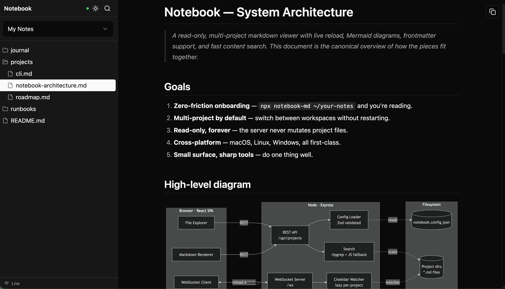

# notebook-md

[](https://www.npmjs.com/package/notebook-md)
[](https://github.com/kareemaly/notebook-md/actions/workflows/ci.yml)
[](LICENSE)
[](https://nodejs.org/)

A read-only, multi-project markdown viewer with live reload, Mermaid diagrams, frontmatter support, and fast file/content search.



## Quickstart

Try it in 5 seconds — no config file needed:

```sh
npx notebook-md ~/your-notes
```

This boots an ephemeral session against that path. Nothing is written to disk.

### Keep it

```sh
npm i -g notebook-md

notebook add ~/notes
notebook add ~/work/docs --name "Work Docs"
notebook serve
```

Then open [http://localhost:9001](http://localhost:9001).

## CLI reference

```
notebook serve [--config <path>]          # long-running server (default behavior)
notebook add <path> [--name <name>]       # append a project to the config file
notebook remove <name|index>              # remove a project from the config file
notebook list                             # print configured projects
notebook <path>                           # ephemeral single-project session, no config read/write
notebook                                  # alias for `notebook serve`
```

## Features

- **Multi-project** — switch between configured project roots in the UI, or pass a path for an ephemeral one-off session.
- **Markdown rendering** — GFM, syntax-highlighted code, and Mermaid diagrams (lazy-loaded).
- **Embedded images & assets** — relative links in markdown resolve against the current file, so PNG/JPG/SVG/PDF/etc. render inline.
- **YAML frontmatter** parsed into a collapsible metadata panel.
- **Fast search** — filename and full-text, powered by ripgrep with a pure-JS fallback. Live highlighting in the open document.
- **File explorer** with full keyboard navigation, auto-reveal of the active file, and `.gitignore`-aware scanning.
- **Live reload** — filesystem watcher updates the open document on external edits; config hot-reload updates the project list without a restart.

Plus: dark mode, resizable sidebar, URL-addressable state (refresh/bookmark restores the exact view), copy-to-clipboard for code blocks, cross-platform (macOS / Linux / Windows). Read-only by design — notebook never writes to your files.

## Keyboard shortcuts

| Key | Action |
| --- | --- |
| `⌘K` / `Ctrl+K` | Search filenames |
| `⌘⇧K` / `Ctrl+Shift+K` | Search file content |
| `Esc` | Close mobile drawer / search |
| `↑` `↓` | Move selection in the file tree |
| `→` `←` | Expand / collapse directory |
| `Enter` | Open file / toggle directory |
| `Home` `End` | Jump to first / last entry |

## Configuration

Config discovery order:

1. `--config <path>` if passed to `notebook serve`
2. `~/.config/notebook/config.json`
3. Built-in defaults (empty project list, port 9001)

`notebook add` always writes to `~/.config/notebook/config.json` (creating it if needed), unless `--config` is passed.

### Example

```json
{
  "port": 9001,
  "projects": [
    {
      "name": "Work Docs",
      "path": "~/work/docs",
      "include": ["guides", "runbooks", "architecture"],
      "exclude": ["guides/drafts"]
    },
    {
      "name": "Personal Notes",
      "path": "~/notes"
    }
  ],
  "watcher": {
    "usePolling": false
  }
}
```

### Project fields

| Field | Type | Description |
| --- | --- | --- |
| `name` | string | Display name shown in the project switcher. |
| `path` | string | Absolute or `~`-prefixed path to the project root. |
| `include` | `string[]` (optional) | Path prefixes (relative, POSIX separators) to expose. If set, only files whose relative path is at or under one of these prefixes are shown. |
| `exclude` | `string[]` (optional) | Path prefixes to hide. Exclude beats include. |

Supported file formats are tracked in `src/supportedFormats.ts`. Today that is just `.md`.

## License

MIT
